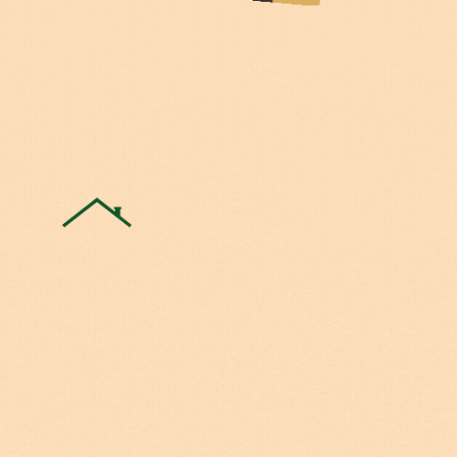

# zoo_neighborhood

[](https://github.com/KenMwaura1/zoo_neighborhood/actions/workflows/pythonpackage.yml)

A Django web application that allows you to be in the loop about everything happening in your neighborhood. From contact information of different handyman to meeting announcements or even alerts.


[](https://www.python.org/)



## Overall Description
### Project perspective
If you are like me, You really don’t know what is happening in your neighborhood most of the time. What if an important meeting happens, theft or even death wouldn’t you like to know about it.

Your Job is to create a web application that allows you to be in the loop about everything happening in your neighborhood. From contact information of different handyman to meeting announcements or even alerts.

## User stories
As a user I would like to:

1. Sign in with the application to start using.
2. Set up a profile about me and a general location and my neighborhood name.
3. Find a list of different businesses in my neighborhood.
4. Find Contact Information for the health department and Police authorities near my neighborhood.
5. Create Posts that will be visible to everyone in my neighborhood.
6. Change My neighborhood when I decide to move out.
7. Only view details of a single neighborhood.


## Live Site

[link to deployed site](https://zoo-neighborhood.herokuapp.com/)

## Setup Instructions / Installation

### Getting Started

### Prerequisites

- Python and pip (I am currently using 3.9.7) Any version above 3.7 should work.
* Git installed on your machine
* Code editor/ IDE
* PostgreSQL installed on your machine

### Installation and Running the App

1. Clone GitHub repository

    ```shell
    git clone https://github.com/KenMwaura1/zoo_neighborhood
    ```

2. Change into the folder

    ```shell
   cd zoo_neighborhood
    ```

3. Create a virtual environment

   ```shell
      python3 -m venv venv 
   ```

    * Activate the virtual environment

   ```shell
   source ./bin/activate
   ```

* If you are using [pyenv](https://github.com/pyenv/pyenv):

  3a. Create a virtualenv

   ```
       pyenv virtualenv zoo_neighborhood
   ```

  3b. Activate the virtualenv

   ```
   pyenv activate zoo_neighborhood
   ```

4. Create a `.env` file and add your credentials

   ```
   touch .env 
   ```

   OR Copy the included example

    ```
    cp .env-example .env 
    ```

5. Add your credentials to the `.env` file

   5a. Create a [free cloudinary account](https://cloudinary.com/) and get your credentials to enable photo uploading deployed.


6. Migrate your database
    ```shell
    python manage.py migrate
    ```

7. Install the required dependencies

   ```shell
   pip install -r requirements.txt
   ```

8. Make the shell script executable

    ```shell
   chmod a+x ./run.sh
    ```

9. Run the app

    ```shell
   ./run.sh
    ```

   OR
   run with python

    ```shell
   python manage.py runserver
    ```

## Tests

* To run the tests:

    ```shell
  python manage.py test
    ```
  
## Technologies used

* Python-3.9.7
* Django web framework
* PostgreSQL
* Cloudinary
* Bootstrap(Material Bootstrap 4)
* HTML5
* CSS3

## Author

[Ken Mwaura](https://github.com/KenMwaura1)


## LICENSE

MIT License

Copyright (c) 2021 Kennedy Ngugi Mwaura

Permission is hereby granted, free of charge, to any person obtaining a copy
of this software and associated documentation files (the "Software"), to deal
in the Software without restriction, including without limitation the rights
to use, copy, modify, merge, publish, distribute, sublicense, and/or sell
copies of the Software, and to permit persons to whom the Software is
furnished to do so.

